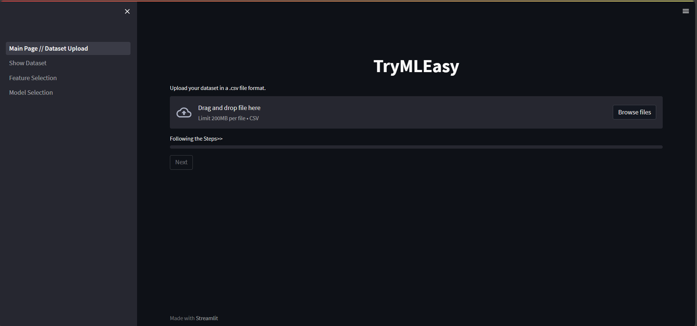
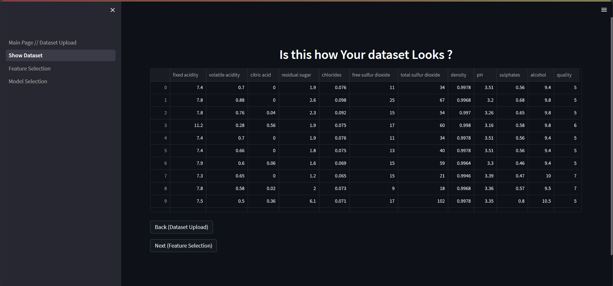
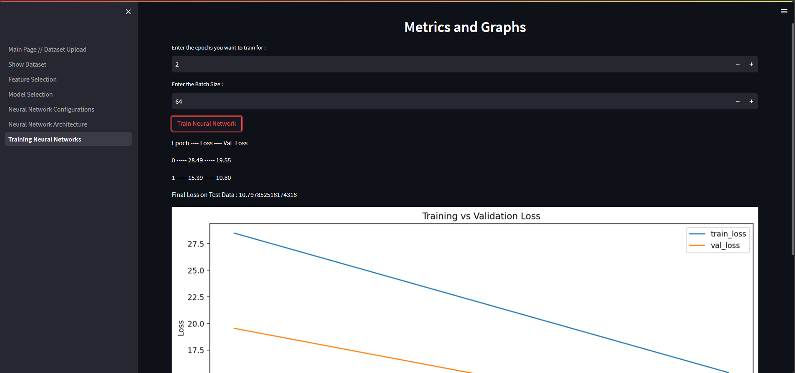

<h1 style="text-align: center;">TryMLEasy v2.0</h1>

<h3 style='text-align:center'>Your No-Code Approch for using Machine Learning Models</h3>
<hr>

Powered by Streamlit Cloud!! Click to visit the Deployed Web-App for Free
[](https://trymleasy-2-0.streamlit.app/)


[](https://travis-ci.org/joemccann/dillinger)    

<hr>

A Python Web App, frontend made with Streamlit, which allows easy implementation of ML models, preprocessing techniques and neural networks on user dataset with GUI and no coding. Implements a no-code approach for implementing machine learning algorithms on a dataset. However, it currently supports numerical features only. Categorical features to be added soon.

## Table of Contents
1. [Changlogs for v2.0](#changelogs-for-v20)
2. [Supported Features](#now-supports-the-following)
3. [Usage](#usage)
4. [Sample Images](#sample-images)
5. [Tech Stack Used](#techstack-used)
6. [Installation and Running](#installation-and-running)
7. [Current Ideas and Future Improvements](#currently-though-ideas-and-future-improvements)
8. [Development and Contributions](#development-and-contributions)
9. [License](#license)  
10. [The Aftermath](#developer-after-software-development-and-then-writing-this-readme) 

## Changelogs (for v2.0):
```
1. Better UI with navigation capabilities
2. First Feature selection then model selection flow (compared to opposite in v1.0)
3. Added Correlation Heatmap for feature analysis
4. Traditional Model now categorized (Classification/Regression)
5. Total 10 models supported (compared to only 3 in v1.0)
6. Total 7 metrics added (compared to only 1 in v1.0)
7. Neural Networks now added with few tunable hyperparameters
    - Look for the new way of adding layers into the model using dynamic dataframe
    - Customize the activation function and neurons of each layer
    - Get a summary and diagram of the model
    - Train on any epoch and batch size of your requirement
8. New and improved Readme
9. Added a Improvements.txt to encourage future improvements
```

## Now supports the following:

#### Preprocessing techniques:
- Standard Scaler
- MinMax Scaler
- Robust Scaler
- Normalization

#### Decomposition techniques:
- Principal Component Analysis (PCA)
- kernal Principal Component Analysis (kPCA)
- Fast Independent Component Analysis (FastICA)

#### Traditional Machine Learning Models:
- Classification Models
    - Logistic Regression 
    - Decision Tree Classifier
    - Gaussian Naive Bayes
    - Support Vector Classification
    - K-Nearest Neighbors
    - Stochastic Gradient Descent Classifier
- Regression 
    - Linear Regression
    - Support Vector Regressor
    - Rigde Regression
    - Least Angle Regression

#### Metrics for Traditional Models:
- Classification
    - Accuracy
    - F1 Score
    - Precision
    - Recall
- Regression
    - Mean Squared Error
    - Explained Variance
    - Max Error

#### Neural Network Configurations and Hyperparamters:
- Dense Layer supported  
- Activation functions supported - ReLU, Sigmoid, Tanh
- Model summary shown with complete architecture
- Epochs
- Batch Size
- Training v/s Validation Loss Graph
- Epoch-wise loss and validation loss values 


## Usage

1. Upload your dataset 
2. Select features and target column
3. (Optional) Select the preprocessing steps and decomposition steps 
4. Use the Slider to set the Test Ratio
5. Select the Type of Machine Learning Model to Apply:
    > For Traditional Models
    >> 1. Select the model type (Classification/Regression)
    >> 2. Select the sub-model from the list
    >> 3. Click on Train Model to train the model and get the results

    > For Neural Networks
    >> 1. Use the table to define the model architecture (Make sure to provide index values) 
    >> 2. Click Next to confirm the model architecture with diagram on next page
    >> 3. Provide the epochs and batch size count as hyperparameters for model training and click on train. 

## Sample Images






## Techstack Used
TryMLEasy uses the following libraries to work properly:

- Streamlit : Helps to create the web app and frontend of the application
- Streamlit Extension Libraries (check requirements.txt for more info)
- Python 
- Scikit-Learn
- Matplotlib
- Tensorflow and Keras

And of course TryMLEasy itself is open source with a [public repository](https://github.com/Gurneet1928/TryMLEasy)
 on GitHub.

## Installation and Running

TryMLEasy requires python v3.8+ to run.

You can use the web-app directly from the streamlit cloud. Incase, you want to tinker with it or run it locally you can clone the repository using:

```sh
git clone https://github.com/Gurneet1928/TryMLEasy.git
```
and then run the following command:
```sh
python -m streamlit run app.py
```
or
```sh
streamlit run app.py
```
or use the deployed link at the beginning of this readme :()

## Currently though ideas and Future Improvements:
Check the Improvement.txt file for better knowledge of what can be done incase you run out of ideas. It Compiles some possible upgrades/updates that can be done to this project.

- More Models and technqiues to be added
- Added option to prompt user incase the dataset is not cleaned
- Maybe a better theme and designs

## Development and Contributions
Really want some peeps to contribute into this. Would love to have some contributions.
Currently very well under developed web app (as of June 2023). 

## Have some Ideas ? Found some Bugs ? 
Create a pull requests, raise an issues.
ORRRR
Mail me at gurneet222@gmail.com

## License

MIT License

Distributed under the License of MIT, which provides permission to any person obtaining a copy of this software and associated documentation files (the "Software"), to deal in the Software without restriction, including without limitation the rights to use, copy, modify, merge, publish, distribute, sublicense, and/or sell copies of the Software. Check LICENSE file for more info.

OR
Free to use
But please make sure attribute the developer....

**Free Software, Hell Yeah!**

## Made till here ? I would like to thank you for reading this whole(possibly) README to reach this endpoint. If you found this software helpful in any case, make sure to star it.    (*^_^*)   (●ˇ∀ˇ●)

## Developer after software development and then writing this Readme:

