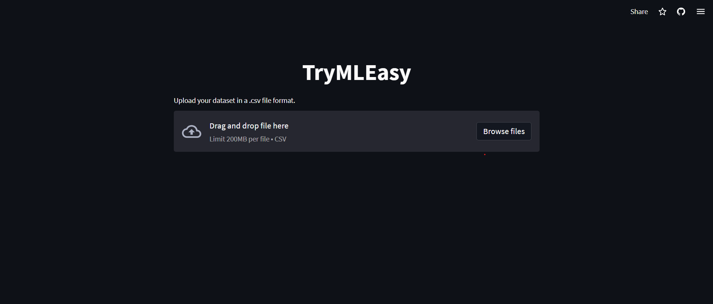
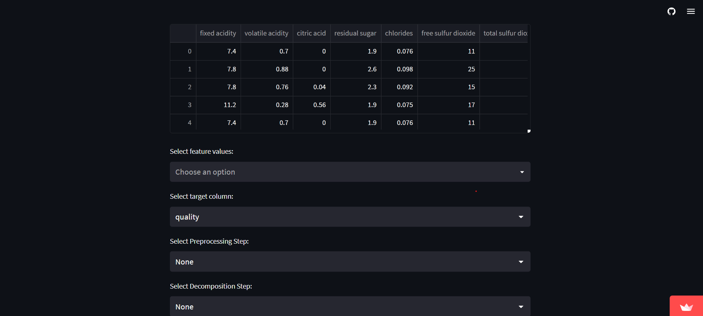
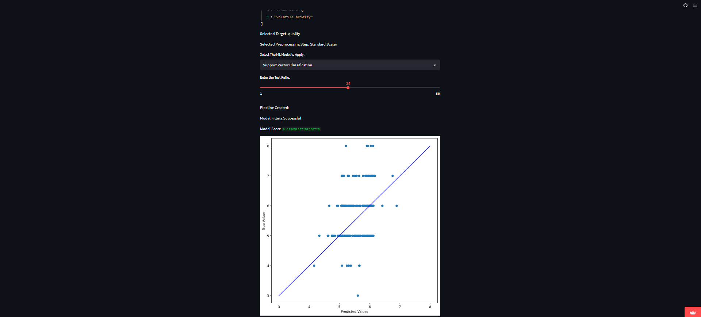

# TryMLEasy (in Development)

[Deployed on Streamlit Cloud (Click Here!!!!)](https://trymleasy.streamlit.app/)

A Python Web App, frontend made with Streamlit, which allows easy implementation of ML models and techniques on user dataset with GUI and no coding.

[](https://travis-ci.org/joemccann/dillinger)


## Usage

1. Upload your dataset 
2. (Optional) Select the preprocessing steps and decomposition steps 
3. Select the Machine Learning Model to Apply
4. Use the Slider to set the Test Ratio
5. The model is implemented successfully

## Sample Images





## Currently support the following:

#### Preprocessing techniques:
- Standard Scaler
- MinMax Scaler
- Robust Scaler
- Normalization

#### Decomposition techniques:
- Principal Component Analysis (PCA)
- kernal Principal Component Analysis (kPCA)
- Fast Independent Component Analysis (FastICA)

#### Machine Learning Models:
- Linear Regression
- Logistic Regression
- Support Vector Classification

## The program currently outputs the follwing:
- The Score of the model on dataset
- True vs. Predicted Graph (Currently needs more development)

## Tech
Healthcare Pro uses the following to work properly:

- Streamlit : Helps to create the web app and frontend of the application
- Python 
- Scikit learn
- Matplotlib

And of course Healthcare pro itself is open source with a [public repository](https://github.com/Gurneet1928/healthcare-pro-gpt)
 on GitHub.

## Installation and Running

Heatlhcare pro requires python v3.8+ to run.

To run the webapp, clone the repository using:

```sh
git clone https://github.com/Gurneet1928/TryMLEasy.git
```
and then run the following command:
```sh
python -m streamlit run app.py
```
or
```sh
streamlit run app.py
```
or use the deployed link at the beginning of this readme :()

## Currently though ideas:
- More Models and technqiues to be added
- Added option to prompt user incase the dataset is not cleaned
- Maybe a better theme and designs
- (Really far) Added feature of neural network configuration

## Development and Contributions
Really want some peeps to contribute into this. Would love to have some contributions.
Currently very well under developed web app (as of June 2023). 

## Have some Ideas ? Found some Bugs ? 
Create a pull requests, raise an issues.
ORRRR
Mail me at gurneet222@gmail.com

## License

MIT License

Distributed under the License of MIT, which provides permission to any person obtaining a copy of this software and associated documentation files (the "Software"), to deal in the Software without restriction, including without limitation the rights to use, copy, modify, merge, publish, distribute, sublicense, and/or sell copies of the Software. Check LICENSE file for more info.

OR
Free to use
But please make sure attribute the developer....

**Free Software, Hell Yeah!**

## Made till here ? I would like to thank you for reading this whole(possibly) README to reach this endpoint. If you found this software helpful in any case, make sure to star it.    (*^_^*)   (●ˇ∀ˇ●)
